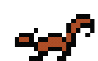

UBC Simulator 2 is a 'choose your own adventure' style browser game where the player tries to survive a year as a student at UBC.
This project is inspired by the [original game](https://slacknotes.com/ubcsimulator) on Slacknotes, go check it out!

## The Team

### Developers

- Cheuk Yin Ng
- Eloise Peng
- Robin Reyes

### Designers

- Jenny Zhang
- Tony Wu
- Vita Chan

## The Approach

Our team was really captivated by the humor and charm of the original game; we thought that events in the original game were written very well, and truly spoke to the student experience at UBC. However, on paper, the game is just a series of events presented to the player in a random order in which the player's choice would have some kind of consequence on the player's likelihood of beating the game. Given this basic structure, our team felt that there was a lot of potential to make the experience more interactive and diverse.

We drew a parallel of the basic structure of the original UBC Simulator to the classic game [The Oregon Trail](https://en.wikipedia.org/wiki/The_Oregon_Trail_(series)) - both games attempt to simulate a real life experience through a series of events that capture the spirit of that experience. On a technical level though, The Oregon Trail had many more features that made the experience it was trying to simulate more immersive than what the original UBC Simulator was able to do, namely:

- time sensitive events
- minigames
- campaign personalization

which became the main features we wanted to include in our iteration of UBC Simulator.

The minimum viable product (MVP) for our project was to at least support the same type of gameplay implemented in the original UBC Simulator, being that we simply allow for the player to run through a campaign of events, giving the player choices that would impact their stats of amount of sleep, number of friends, and GPA. Given this, one of the earliest things we did was drafting up a list of events we could put in the game. Each member of the team had different kinds experiences at UBC, so we were able to come up with a diverse set of events.

Another thing we did early in the process was protoyping the UI of our application, whose design we drew heavy inspiration from The Oregon Trail and the original UBC Simulator.

The planning we did earlier on in the development of our project proved to be a good foundation for the work we did throughout the year.

## The Technology

Since our projects is pure front end work, our tech stack is not that complicated. Initially, we planned to develop on this project with pure TypeScript, but this proved to be us underestimating the complexity of what needed to be done. We eventually incorporated more technology into our project which are very relevant in the industry today, and working on this project served as good practice.

### React

Using React's state management proved to be useful in the way we decided to build our game engine, as supposed to creating our own state management system. Using React also provided our project with some modularity, allowing the project to more easily support development on a team.

### Unity

We chose Unity as our primary driver for developing minigames mainly for the utility of not having to create a new game engine for every minigame we want to create. This helped us expedite the number of minigames we were able to include in the game, as without it, we could have potentially gone the whole school year without finishing a single minigame. Luckily, we were able to find a library we could use to display WebGL builds of Unity projects in a React project in [React Unity WebGL](https://github.com/elraccoone/react-unity-webgl).

## The Art

We went for a 90s game console look, so pixel art was an appropriate choice! This art style also makes creating templates a lot easier such that art between each designer is consistent.

### Backgrounds
### Characters

To standardize character creations, we created a character template system with different skintones, hairstyles, clothing, shoes, and accessories options.

### Animations

Minigames have moving parts and animations. Below is the sprite sequence.

 | 

## The Challenges

As with any team, our team had our share of struggles in working on this project together.

First of all, our team started out having a few more members than we currently have. UBC Launch Pad in general asks a non-zero amount of time for each member to dedicate every week, and while it's easy to say you can make that commitment during the recruiting process, it's a different story when students are forced to juggle many other commitments in the heat of the school year. While our team was struggling with commitment issues with some former members, it was difficult to get work done when the tasks of less committed members were blocking the progress of other tasks. As the year progressed and it became more clear which members had the capacity to finish their tasks on time, it became easier to plan what tasks to prioritize on a week to week basis. Fortunately, the transition to having less hands on deck went smoothly as our current members took on the additional load of work well.

On the topic of having the work of some being blockers for others, this issue was something our team struggled with throughout the whole process. Being purely a front end project, communication between the developers and designers was key to getting most aspects of the project done. There were many instances where the assets of the designers were left sitting on the side because the features they were meant for have not been developed yet, or some features could not be fully implemented because of some missing assets. This fact gave each member a bit more responsibility, as they are not only responsible for the work they are doing being a step to completing a project, but more than likely another member of the team is waiting for their work to be finished. This was most emphasized towards the beginning and end of the project - at the beginning much of what the designers had worked on could not be integrated due to the work needed by the developers to set up the game engine and general infrastructure first, and towards the end, when most of the infrastructure has been put in place, there was a lot of design work to do to give the project more polish.
